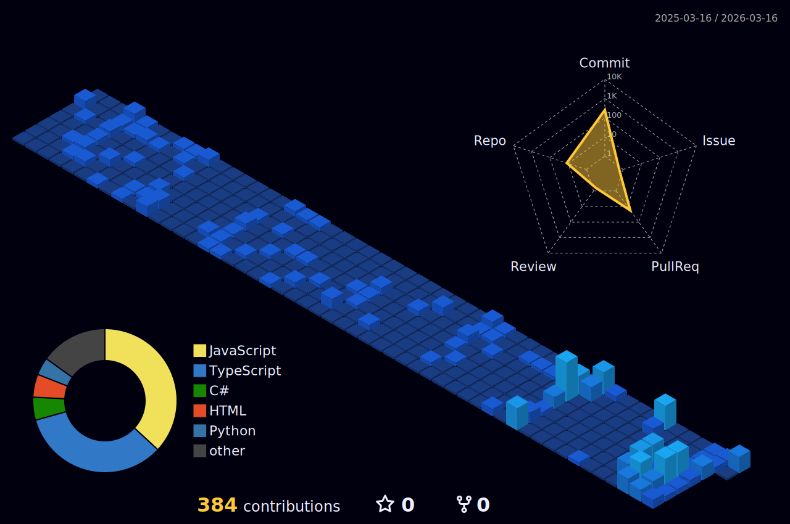

<p align="center">
  
</p>

<h1> Hello Fellow < Coders/ >!  </h1>

<p align='center'>

</p>

<p align='center'>
</img>
</p>

<hr>
<br>

<p align='center'>
&nbsp;&nbsp;&nbsp;&nbsp;
&nbsp;&nbsp;&nbsp;&nbsp;
</p>

<br>

## 👋 About Me

```ruby
class Developer
  def initialize
    @name          = "Kazhuro Gleb"
    @location      = "Belarus 🇧🇾"
    @current_focus = "Ruby on Rails 💎"
    @background    = "Ex-Indie Game Dev 🎮 turned Web Developer 🕸️"
    @status        = "College student building professional web apps 🚀"
  end

  def current_goal
    "Always Learning, Always Building"
  end
end

me = Developer.new
```

<hr>
<br>

## Github Contribution Streak 🔥 
<br>
<p align='center'></p>

<hr><br>

## Most Used Languages 📚
<br>
<p align='center'>

</p>
<p align='center'>
<h6>Note: Does not indicate my skill level, it's a GitHub metric of which languages have the most code on GitHub.</h6>
</p>

<hr>
<br>

## 3D Contribution Calendar 📅
<br>
<p align='center'>

</p>
<hr>
<br>

## Technology Stack 💻

<p align='center'>
</img>
</p>

### Languages 🖥 :
<br>
<p align='center'>
&nbsp;&nbsp;
&nbsp;&nbsp;
&nbsp;&nbsp;
&nbsp;&nbsp;
&nbsp;&nbsp;
&nbsp;&nbsp;
&nbsp;&nbsp;
&nbsp;&nbsp;
&nbsp;&nbsp;
&nbsp;&nbsp;
</p>
<br>

### Frameworks & Platforms 🚀 :
<br>
<p align='center'>
&nbsp;&nbsp;
&nbsp;&nbsp;
&nbsp;&nbsp;
</p>
<br>

### Databases 💾 :
<br>
<p align='center'>
&nbsp;&nbsp;
&nbsp;&nbsp;
&nbsp;&nbsp;
&nbsp;&nbsp;
&nbsp;&nbsp;
&nbsp;&nbsp;
</p>
<br>

### DevOps & Tools 🔧 :
<br>
<p align='center'>
&nbsp;&nbsp;
&nbsp;&nbsp;
&nbsp;&nbsp;
&nbsp;&nbsp;
&nbsp;&nbsp;
&nbsp;&nbsp;
&nbsp;&nbsp;
</p>
<br>

### Operating Systems 🐧 :
<br>
<p align='center'>
&nbsp;&nbsp;
&nbsp;&nbsp;
&nbsp;&nbsp;
</p>

<hr>
<br>

## Github Contributions 📈
<br>
<p align='center'>

</p>

<hr>
<br>

## Just a snake eating my contributions 🐍
<p align='center'>
<picture>
  <source
    media="(prefers-color-scheme: dark)"
    srcset="https://raw.githubusercontent.com/Goldie228/Goldie228/output/github-contribution-grid-snake-dark.svg"
  />
  <source
    media="(prefers-color-scheme: light)"
    srcset="https://raw.githubusercontent.com/Goldie228/Goldie228/output/github-contribution-grid-snake.svg"
  />
  
</picture>
</p>

<hr>
<br>

## Dynamic Quotes 📜:
<br>
<p align='center'>

</p>

<hr>
<br>

<h2 align='center'>Support Me By Starring ⭐ Some Of My Repositories</h2>
<br>

<p align='center'>
</img>
</p>
<br>

<h2 align='center'>Thank You!</h2>
<br>

<p align="center">
  
</p>

<!--
===========================================
🐍 SNAKE ANIMATION SETUP INSTRUCTIONS 🐍
===========================================

To enable the snake animation, create a file at:
.github/workflows/snake.yml

With the following content:

name: Generate Snake

on:
  schedule:
    - cron: "0 0 * * *"  # Runs every day at midnight
  workflow_dispatch:      # Allows manual trigger

jobs:
  generate:
    runs-on: ubuntu-latest
    timeout-minutes: 10

    steps:
      - name: Generate github-contribution-grid-snake.svg
        uses: Platane/snk/svg-only@v3
        with:
          github_user_name: Goldie228
          outputs: |
            dist/github-contribution-grid-snake.svg
            dist/github-contribution-grid-snake-dark.svg?palette=github-dark

      - name: Push github-contribution-grid-snake.svg to the output branch
        uses: crazy-max/ghaction-github-pages@v3.1.0
        with:
          target_branch: output
          build_dir: dist
        env:
          GITHUB_TOKEN: ${{ secrets.GITHUB_TOKEN }}

===========================================
-->
